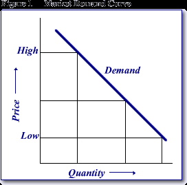
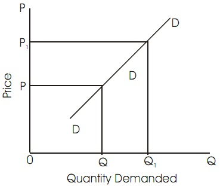
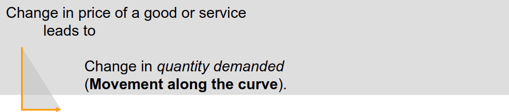
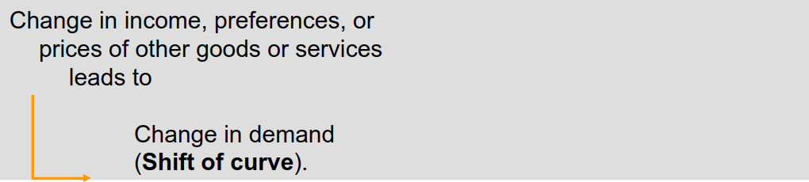
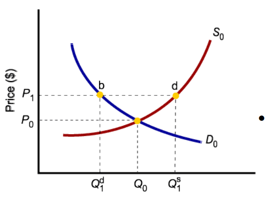
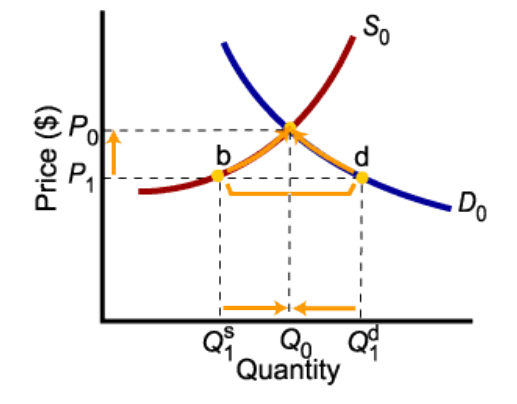
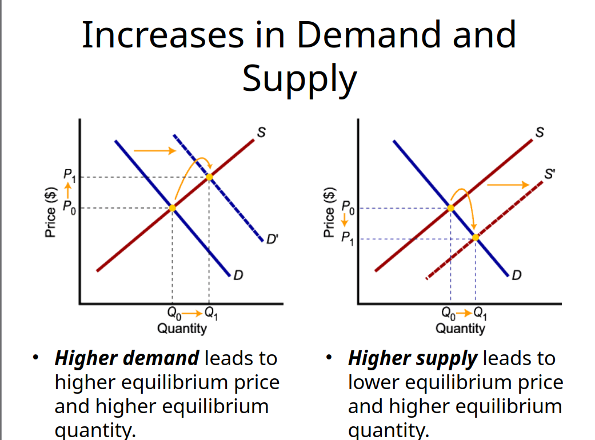
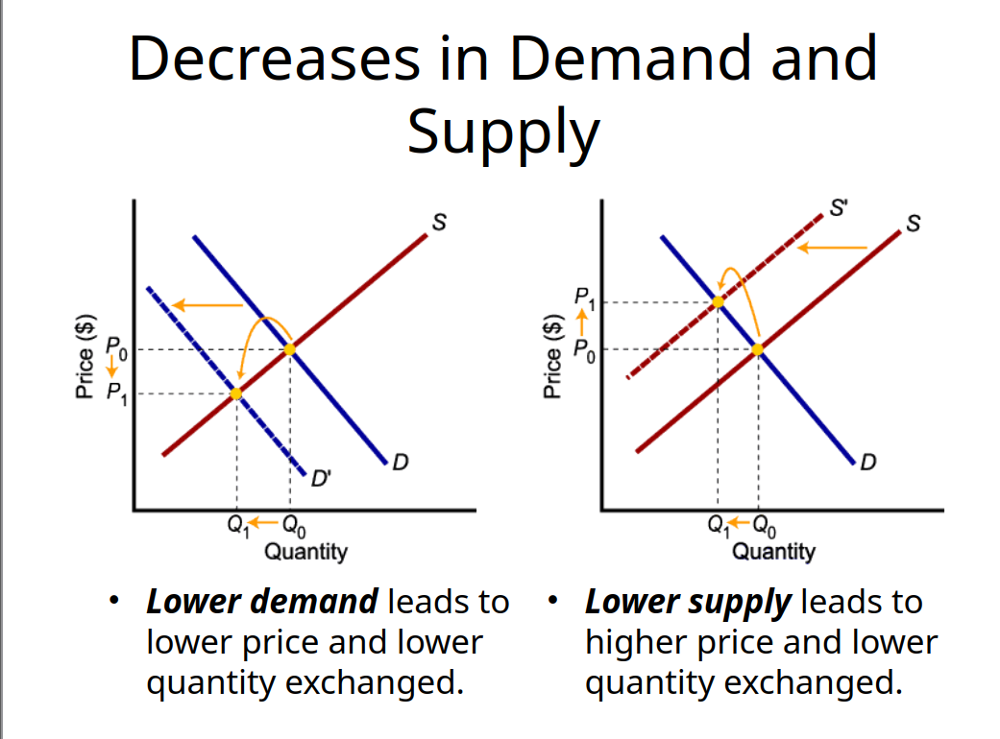

Economics – the study of how individuals and societies make decisions about ways to use scarce resources to fulfill wants and needs.

Economics is the science that deals with the production, consumption, distribution and exchange of wealth. 

factor of production
LAND – Natural Resources
Water, natural gas, oil, trees (all the stuff we find on, in, and under the land)
LABOR – Physical and Intellectual
Labor is manpower 
CAPITAL - Tools, Machinery, Factories
The things we use to make things
ENTREPRENEURSHIP – Investment $$$
Investing time, natural resources, labor and capital are all risks associated with production

Demand means wish or desire to have commodity 
Two things must be fulfilled for existence of demand
Will to purchase any thing 
Power to purchase a commodity 
“Demand is the quantity of a commodity which the consumers are prepared to purchase at a certain price during a specific period of time”.      

price demand 
It refers to the various quantities of a commodity or service that a consumer would purchase at a given time in a market at a various prices.
It is assumed that other things such as consumer’s income, tastes and prices of interrelated goods remain unchanged.  
income demand 
It refers to the various quantities of a commodity or service which would be purchased by a consumer at various level of income.
It is assumed that other things such as price, tastes and desire of consumer do not  change.
cross demand 
It refers to the various quantities of a commodity or service which will be purchased with reference to change in the price not of this good but of other interrelated goods. 
These goods are either substitutes or complementary goods. 

equilibrium
An equilibrium is the condition that exists when quantity supplied and quantity demanded are equal.

dis equilibrium
When quantity demanded exceeds quantity supplied, price tends to rise until equilibrium is restored.

When quantity supplied exceeds quantity demanded, price tends to fall until equilibrium is restored.

